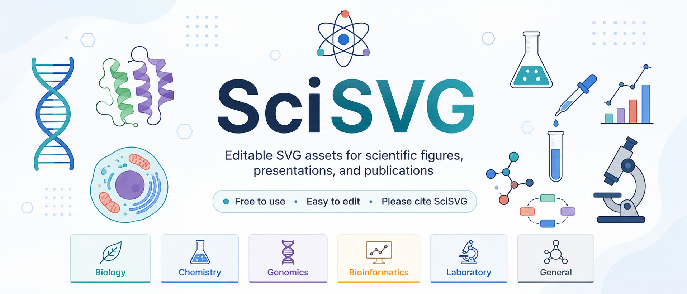

<p align="center">
  
</p>

> The editable vector version of the banner is also available: [`branding/scisvg-banner.svg`](branding/scisvg-banner.svg).

# SciSVG

**Open scientific vectors for figures, presentations, and publications.**

**Free to use. Free to modify. Attribution required.**

<p>
  <a href="LICENSE-ASSETS"></a>
  <a href="LICENSE"></a>
  <a href="CITATION.cff"></a>
</p>

> **Scientific illustrations and SVG assets are licensed under Creative Commons
> Attribution 4.0 International (CC BY 4.0).**
> **Software, scripts, and website code are licensed under the MIT License.**

SciSVG is an open scientific illustration library of clean, editable vector
graphics — designed to be found, edited, and cited. Every asset is a
hand-structured SVG with named layers and embedded metadata, organised by
scientific domain and searchable in the online gallery.

## Browse the library

The interactive gallery provides fuzzy search, category filtering, live SVG
previews, downloads, citation copying, and a detail view for every asset.

**Gallery:** <https://saveenasolanki.github.io/SciSVG/>

## What's inside

| Category | Subcategories | Assets |
|---|---|---|
| [Biology](assets/biology/) | cells, organelles, proteins, dna-rna, pathways, organisms | mitochondrion, cell membrane, animal cell, neuron, ribosome, DNA double helix, chromosome, plasmid |
| [Chemistry](assets/chemistry/) | molecules, reactions, glassware, instrumentation | benzene ring, peptide bond, protein–ligand binding, reaction arrow, Erlenmeyer flask |
| [Bioinformatics](assets/bioinformatics/) | genomics, networks, machine-learning, workflows, databases | heatmap, sequence alignment, gene structure, sequencing reads, phylogenetic tree, neural network, workflow pipeline |
| [Laboratory](assets/laboratory/) | equipment, workflows, consumables | microscope, micropipette, test tube rack, 96-well plate, petri dish |
| [General Science](assets/general-science/) | — | arrow right, curved arrow, axes, magnifier, layers |
| [Medicine](assets/medicine/) | anatomy, disease, clinical | *open for contributions* |

**30 assets today.** Every asset is a `512×512` editable SVG with named layers,
embedded `<title>`/`<desc>` metadata, and per-asset searchable metadata in
[`metadata/assets.json`](metadata/assets.json).

## How to use an SVG

1. Browse the gallery or the `assets/` folders.
2. Download the `.svg` file.
3. Edit it in Illustrator, Inkscape, Figma, PowerPoint, Keynote, Affinity Designer, or any SVG-compatible application.
4. Add attribution to SciSVG in the figure legend, acknowledgements, slide footer, website, or references as appropriate.

## Required attribution

All SVG artwork under `assets/` (and the banner under `branding/`) is released
under **CC BY 4.0** unless a file explicitly states otherwise.

A compact attribution is sufficient for slides, websites, posters, and figures:

> **SciSVG — Saveena Solanki, CC BY 4.0, https://github.com/SaveenaSolanki/SciSVG**

For academic manuscripts, please cite:

> **Solanki, S. (2026). SciSVG: An Open Scientific SVG Illustration Library. GitHub. https://github.com/SaveenaSolanki/SciSVG**

GitHub also exposes citation metadata from [`CITATION.cff`](CITATION.cff). If a
DOI is added through Zenodo later, the DOI-based citation can replace the
repository citation.

## Adding new SVGs — the easy way

Contributors do **not** need to understand the whole repository:

```bash
python scripts/add_svg.py my_figure.svg
```

The tool validates your SVG, asks for category/keywords/name, places the file
in the right folder, records you as contributor, and rebuilds the catalog.
Full guidelines are in [`CONTRIBUTING.md`](CONTRIBUTING.md).

```text
source/            editable Illustrator/Inkscape originals (masters)
assets/            optimized, validated publication SVGs (canonical)
previews/          generated PNG/WebP previews (build artifacts, gitignored)
metadata/          assets.json (generated), categories.json, contributors.json
website/           GitHub Pages gallery
scripts/           validation, optimization, catalog, previews, contributor tool
tests/             test suite (pytest)
```

## Validation & quality standard

Every asset must pass [`scripts/validate_svgs.py`](scripts/validate_svgs.py):
XML validity, `viewBox` required, no scripts, no event handlers, no raster
images, no external resources, no duplicate IDs, no broken references,
kebab-case filenames, and the CC BY 4.0 attribution comment. Distributed SVGs
are optimized with SVGO ([`svgo.config.js`](svgo.config.js)), which is
configured to **preserve attribution comments**, `<title>`, `<desc>`, and
`viewBox`.

CI (`.github/workflows/`) validates every push/PR, rebuilds the catalog on
`main`, and deploys the gallery to GitHub Pages.

## Repository structure

```text
SciSVG/
├── README.md
├── LICENSE                ← MIT (software)
├── LICENSE-ASSETS         ← CC BY 4.0 (artwork + documentation)
├── CITATION.cff
├── CONTRIBUTING.md
├── CODE_OF_CONDUCT.md
├── SECURITY.md
├── CHANGELOG.md
├── ROADMAP.md
├── branding/
│   └── scisvg-banner.svg
├── assets/
│   ├── biology/           cells, organelles, proteins, dna-rna, pathways, organisms
│   ├── chemistry/         molecules, reactions, glassware, instrumentation
│   ├── medicine/          anatomy, disease, clinical (open for contributions)
│   ├── laboratory/        equipment, workflows, consumables
│   ├── bioinformatics/    genomics, networks, machine-learning, workflows, databases
│   └── general-science/
├── source/                reserved for editable masters
├── previews/              generated (gitignored)
├── metadata/              categories.json, contributors.json, assets.json (generated)
├── scripts/               validate_svgs.py, optimize_svgs.py, build_catalog.py,
│                          generate_previews.py, check_metadata.py,
│                          check_duplicates.py, add_svg.py
├── website/               index.html, style.css, app.js, catalog.json
├── tests/                 test_svgs.py
└── .github/
    ├── workflows/         validate-svg.yml, build-catalog.yml, deploy-pages.yml
    ├── ISSUE_TEMPLATE/    svg_request.yml, scientific_error.yml, bug_report.yml
    ├── PULL_REQUEST_TEMPLATE.md
    └── dependabot.yml
```

## Contributing

Contributions are welcome — see [`CONTRIBUTING.md`](CONTRIBUTING.md) and the
[`ROADMAP.md`](ROADMAP.md). Contributors submit only artwork they created
themselves or have the legal right to release under CC BY 4.0.

## License

- **SVG artwork in `assets/` and `branding/`: CC BY 4.0 — attribution required.** See [`LICENSE-ASSETS`](LICENSE-ASSETS).
- **Software (scripts, website, tests, workflows): MIT.** See [`LICENSE`](LICENSE).

---

<p align="center"><strong>SciSVG</strong> — open scientific vectors, designed to be reused and cited.</p>
